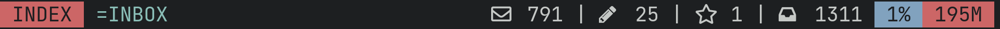

# neomutt-lightline

This configuration file for the [neomutt](https://github.com/neomutt/neomutt) email client will give you a statusline with the same design aesthetic as the [lightline.vim](https://github.com/itchyny/lightline.vim) and [vim-airline](https://github.com/vim-airline/vim-airline) plugins for Vim.

